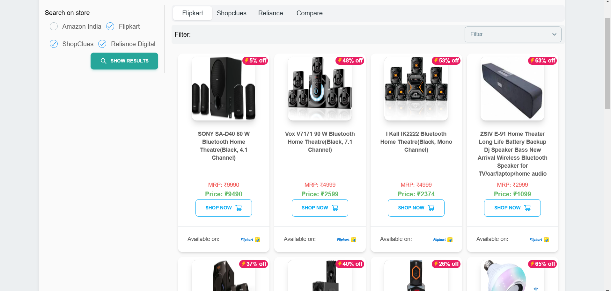
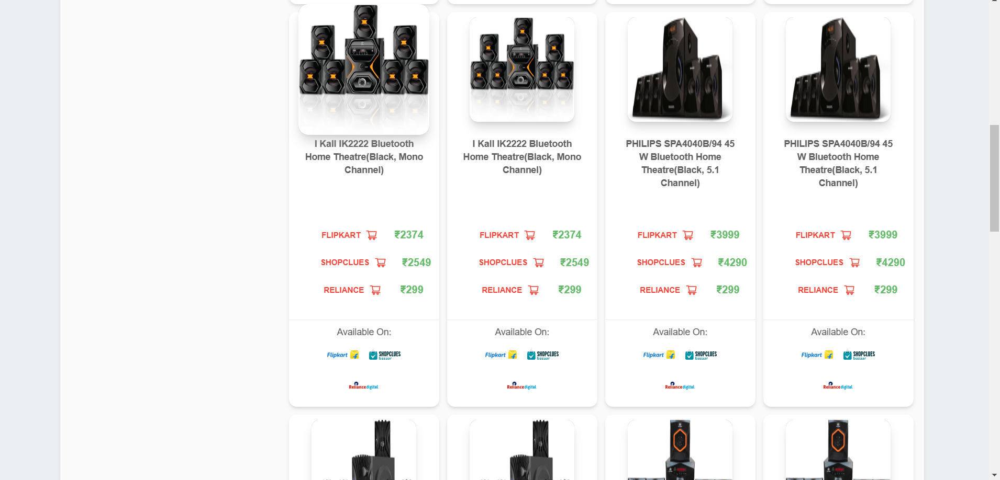

# Thrifty Thumbs

Thrifty Thumbs is a price comparison website that helps users to find the best deals on products from various online stores. With Thrifty Thumbs, users can compare prices of a product across different stores like Amazon, Flipkart, Reliance Digital, and Shopclues.

## Features

- Search for products from different stores
- Compare product prices from different stores using machine learning techniques (Nearest Neighbour)
- View the product image and price from different stores
- Click on the 'Buy Now' button to visit the store and purchase the product

## Technology Stack

The following technologies have been used to build this website:

### Backend - Django and Django Rest Framework

### Frontend - React JS

## Screenshots

### Home Page

### Search Results

### Product Comparison

## Installation

Follow the below steps to run the project locally:

- Clone the repository
- `git clone https://github.com/iamharshkr/thrifty-thumbs.git`
- Navigate to the project directory `cd thrifty-thumbs`
- Add Amazon and Flipkart Affiliate api key in api/webScrape.py file
- Install the dependencies `pip install -r requirements.txt`
- Start the backend server `python manage.py runserver`
- Navigate to Frontend directory `cd frontend`
- Install all neccessary libraries `npm install`
- Start the frontend server `npm start`
- Open the website on your browser at http://localhost:3000

## Contributing

We welcome contributions from the community. If you'd like to contribute, please follow these steps:

### Fork the repository

- Create a new branch
- Make your changes and commit them
- Push to the branch
- Open a pull request

## License

This project is licensed under the MIT License - see the LICENSE.md file for details.
